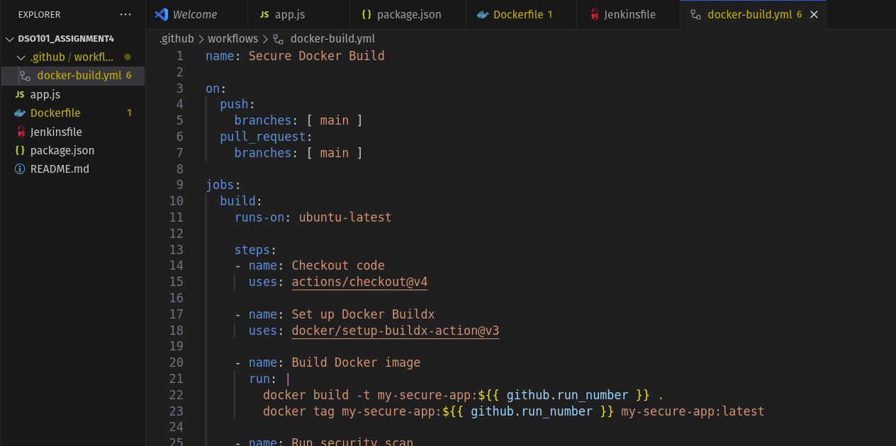
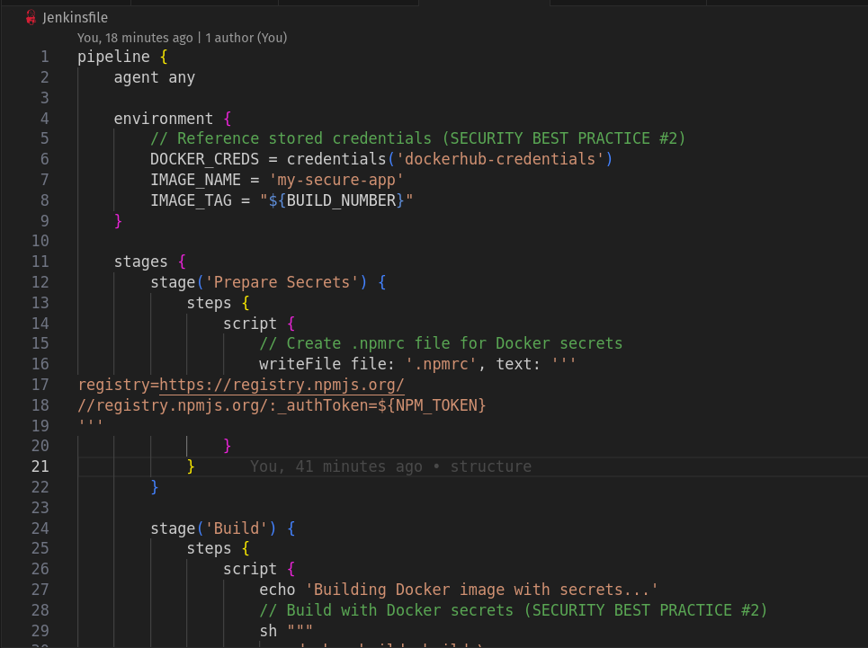

# Assignment4 - Secure CI/CD Pipeline with Docker and GitHub Actions

## Objective

This project demonstrates the implementation of a secure CI/CD pipeline using Docker containerization and GitHub Actions, focusing on integrating security best practices to ensure safe application deployment. The main goals are to:

- Create a secure Docker application with non-root user configuration
- Implement Docker secrets to protect sensitive information during builds
- Set up automated CI/CD pipelines using GitHub Actions and Jenkins
- Demonstrate secure credential management and deployment workflows
- Ensure sensitive data is not exposed in build history or container image

## Steps Involved

1. Application Development

Created a simple Node.js Express application with health endpoints

Configured package.json with proper dependencies

Implemented basic REST API functionality



2. Docker Security Implementation

- Best Practice #1: Non-Root User

```
# Create and use non-root user
RUN adduser -D appuser
USER appuser

```

- Best Practice #2: Docker Secrets

```
# Use secrets during build to avoid exposing sensitive data
RUN --mount=type=secret,id=npmrc,target=/root/.npmrc \
    npm install
```

3. CI/CD Pipeline Setup

- GitHub Actions Workflow

Automated builds on code push

Secure credential management using GitHub Secrets


Docker image building with secrets

Automated deployment to Docker Hub

successful actions workflow


- Jenkins Pipeline

Alternative CI/CD implementation

Credential management through Jenkins secrets


Multi-stage pipeline with build, test, and deploy phases




successful jenkins pipeline build


Pushed image to dockerhub.


4. Security Configuration

Configured .dockerignore to exclude sensitive files

Set up repository secrets for Docker Hub authentication

Implemented secret cleanup in pipeline workflows

## Challenges faced

1. Docker Build Complexity

Challenge: Initial Dockerfile was overly complex with multiple optimization layers that caused build failures.


Solution: Simplified the Dockerfile while maintaining security best practices, focusing on essential security features rather than advanced optimizations.

## Learning Outcomes

Docker Security: Understanding of container security principles and implementation

CI/CD Automation: Hands-on experience with GitHub Actions and Jenkins

Pipeline Design: Creating efficient and secure automated workflows

Error Handling: Implementing proper cleanup and error recovery

Monitoring: Setting up logging and visibility for pipeline execution

Documentation: Importance of clear documentation for security processes

## Conclusion

This project successfully demonstrates the implementation of a secure CI/CD pipeline that addresses critical security concerns in modern DevOps practices. The key achievements include:

Security Implementation: Both required security best practices were successfully implemented - non-root user execution and Docker secrets management. This ensures that containers run with minimal privileges and sensitive information is protected during the build process.

Automation Success: The CI/CD pipelines automate the entire process from code commit to production deployment while maintaining security standards throughout each stage.

This implementation serves as a foundation for understanding how to build secure, automated deployment pipelines that protect sensitive information while maintaining the speed and reliability that modern software development requires. The lessons learned and practices implemented here are directly applicable to enterprise-level DevOps environments where security and automation are equally critical.# DSO101_Assignment_4
