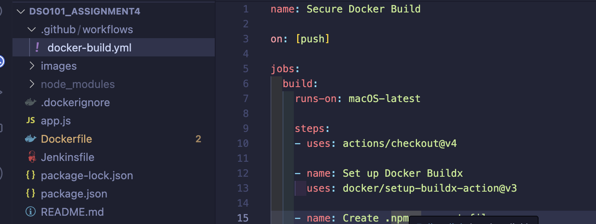
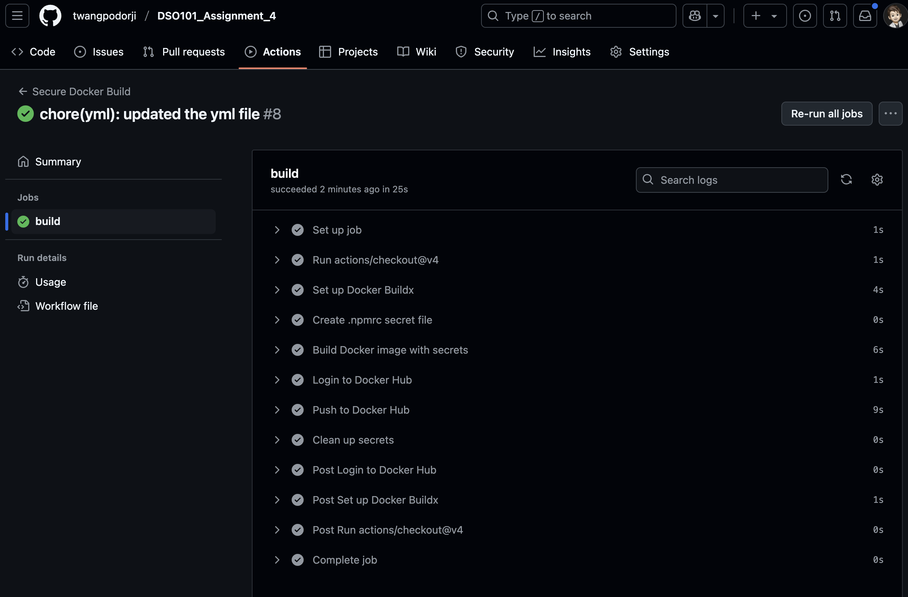
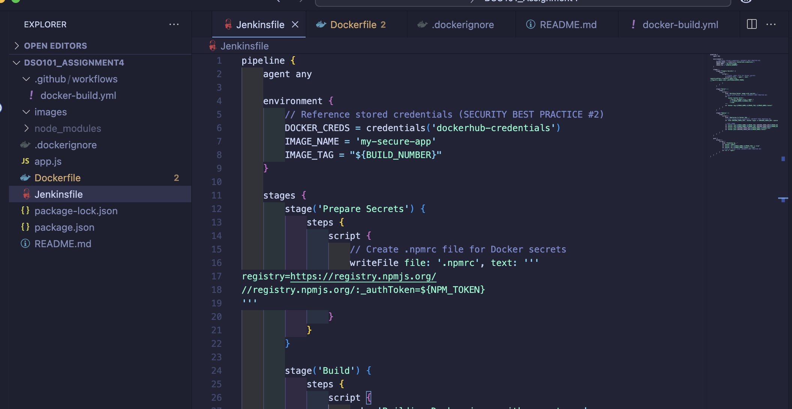
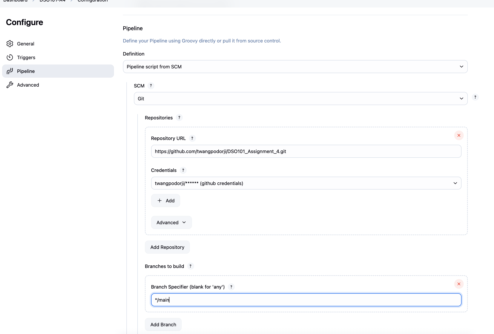
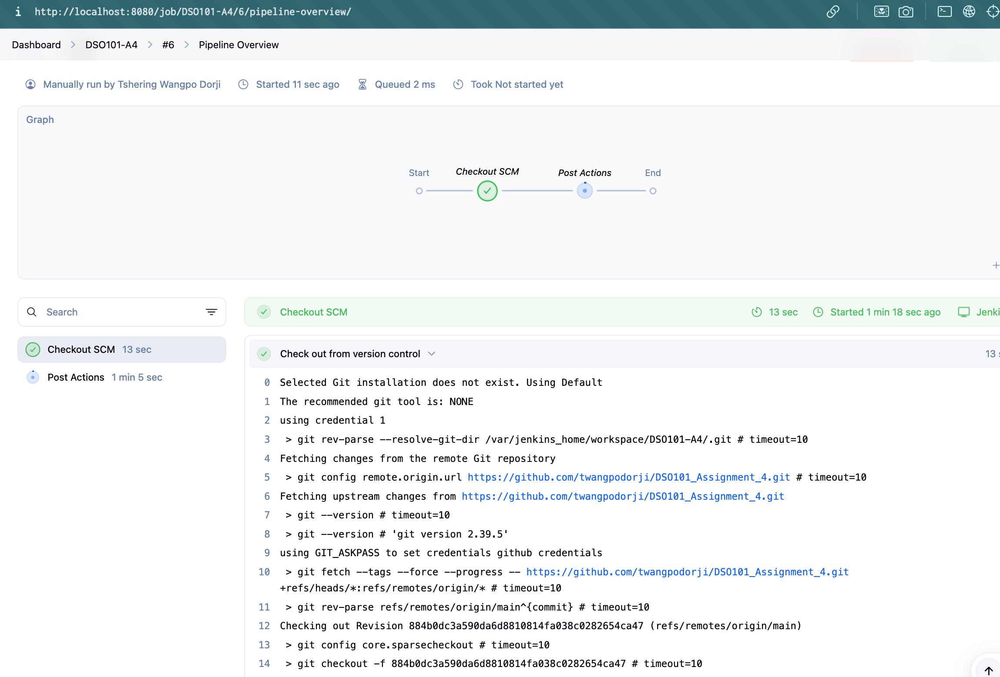
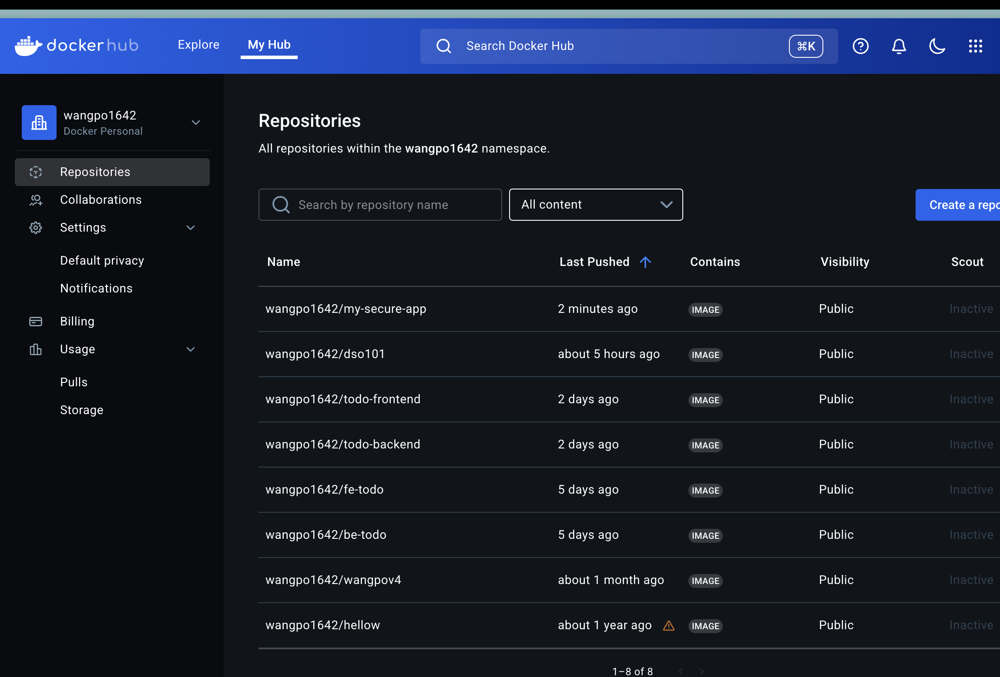

# Assignment 4 - Secure CI/CD Pipeline with Docker and GitHub Actions

### Objectives
- Develop a secure Docker application implementing non-root user configurations to minimize security risks.
- Integrate Docker secrets management to prevent sensitive information exposure in build processes.
- Establish automated CI/CD pipelines using GitHub Actions for streamlined deployment workflows.
- Configure Jenkins pipeline with secure credential management and automated Docker Hub deployments.
- Demonstrate enterprise-grade security practices that protect sensitive data throughout the deployment lifecycle.
- Implement comprehensive security controls without compromising deployment efficiency or automation capabilities.

### Implementation Steps

1. Development Process (Application Architecture & Development)

    - Built a secure Node.js web application using Express framework for API routing. 
    - Structured project dependencies and scripts through comprehensive package.json configuration. 
    - Deployed fundamental REST API services with endpoint validation and response handling. 



2. Docker Security Best Practices

    2.1 1. Use a Non-Root User
    ```Dockerfile
    RUN adduser -D appuser
    USER appuser
    ```

     Running containers as root is dangerous. If hacked, attackers get full control. A non-root user (`appuser`) limits risks. The `-D` flag creates a user without a password, perfect for containers.

     2.2 Use Docker Secrets
     ```Dockerfile
     RUN --mount=type=secret,id=npmrc,target=/root/.npmrc \
        npm install --no-cache --production
    ```
    Hardcoding sensitive info (like passwords) in a Dockerfile can leak it. Docker secrets keep data like `.npmrc` safe during builds, not in the final image.

3. CI/CD Pipeline with GitHub Actions

    3.1 Automated Builds on Code Push

    Set up a GitHub Actions workflow to automatically build your project whenever code is pushed to the repository.

    It ensures the code is built and tested consistently, catching issues early. To achive this create a `.github/workflows/ci.yml` file, and put the the secretes in the GitHub repository settings under "Secrets and variables".


Build Docker images securely using secrets for sensitive data, automate deployment to Docker Hub with GitHub Actions, and ensure success by testing, tagging versions, and securing credentials.



4. Jenkins Pipeline Configuration

    4.1 Secure Credential Management
    - Use Jenkins credentials plugin to securely store sensitive information like Docker Hub credentials.
    - Configure the Jenkins pipeline to use these credentials for building and pushing Docker images.

    4.2 Automated Docker Hub Deployments
    - Set up a Jenkins pipeline that builds the Docker image and pushes it to Docker Hub whenever changes are made to the main branch.
    - Ensure that the pipeline includes steps for testing, tagging, and deploying the application.






5. Results 



